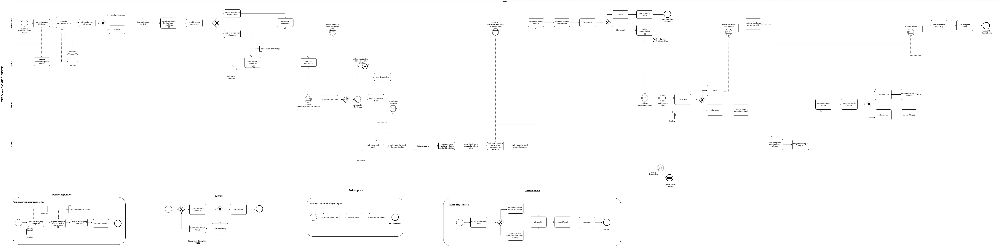

# Proyek Model Proses Bisnis (BPMN): Alur Kerja Sistem Penjualan Online

Ini adalah proyek tugas akhir yang memodelkan dan memvisualisasikan alur proses bisnis pada sebuah platform e-commerce (Sistem Penjualan Online). Model ini dibuat menggunakan notasi standar BPMN 2.0 untuk memetakan interaksi antara Pembeli, Sistem, Penjual, dan Kurir.

## 📊 Diagram Proses Utama

Diagram berikut mengilustrasikan alur kerja utama (end-to-end) dari pencarian barang oleh pelanggan hingga pesanan selesai diterima.

## 📝 Deskripsi Detail Alur Proses

Proses bisnis ini melibatkan 4 aktor utama yang direpresentasikan dalam *swimlane* terpisah. Berikut adalah rincian alur kerja untuk masing-masing aktor:

### 1. Pembeli
Aktor eksternal yang memulai dan mengakhiri siklus pemesanan.
1.  Memulai dengan **Mencari barang** dan **Melihat detail barang**.
2.  **Memasukkan barang ke keranjang** dan melanjutkan ke proses pembayaran.
3.  **Mengisi data pengiriman** dan **Memilih metode pembayaran**.
4.  **Melakukan pembayaran** dan menunggu verifikasi dari sistem.
5.  Menerima notifikasi bahwa pesanan sedang diproses.
6.  Menunggu barang datang, dan setelah **Menerima barang**, proses diakhiri dengan **Memberi penilaian produk**.

### 2. Sistem Penjualan Online
Merepresentasikan semua proses otomatis yang dijalankan oleh website atau aplikasi.
1.  **Menampilkan halaman utama** dan menyajikan informasi dari **Database Barang**.
2.  Setelah pembayaran diterima, sistem **Memverifikasi pembayaran**.
3.  Mengirim notifikasi internal (`Notifikasi pembayaran berhasil`) dan eksternal (`Mengirim notifikasi pesanan diproses`).
4.  Meneruskan pesanan ke Penjual (`Mengirim notifikasi pesanan`).
5.  Setelah menerima update dari Penjual, sistem **Mengirim notifikasi barang dikirim**.
6.  Terakhir, sistem **Menyimpan penilaian produk** yang diberikan oleh pembeli ke dalam **Database Penilaian**.

### 3. Penjual
Pengguna internal yang bertanggung jawab atas pemenuhan pesanan.
1.  Menerima notifikasi pembayaran dan **Menerima pesanan** dari sistem.
2.  **Memproses pesanan** dan melakukan pengecekan ketersediaan stok.
3.  **Jika barang tersedia:**
    * **Menyiapkan barang** dan **Mengemas barang**.
    * **Menyerahkan barang ke kurir** untuk pengiriman.
    * Setelah mendapatkan nomor resi dari kurir, Admin **Menginput nomor resi** ke dalam sistem dan **Mengupdate status pengiriman**.
4.  **Jika barang tidak tersedia:**
    * Admin akan **Menghubungi pelanggan** untuk konfirmasi.
    * Melanjutkan ke proses **Melakukan refund**, dan proses untuk pesanan ini berakhir.

### 4. Kurir
Pihak eksternal yang bertanggung jawab untuk logistik dan pengiriman.
1.  Menerima informasi pengiriman dan **Menerima barang dari penjual**.
2.  **Mengirim barang ke alamat tujuan** pembeli.
3.  **Memberikan nomor resi** kepada Penjual sebagai bukti pengiriman.
4.  Setelah barang diterima pembeli, Kurir **Mengupdate status barang telah diterima**.

## ⚙️ Diagram Sub-Proses

Selain alur utama, terdapat beberapa sub-proses penting yang dimodelkan secara terpisah:

#### 1. Proses Registrasi
Alur untuk pengguna baru membuat akun. Meliputi proses **Mengisi informasi akun**, **Verifikasi email**, hingga data tersimpan di **Data Akun**.

#### 2. Login
Alur untuk pengguna yang sudah ada masuk ke sistem. Meliputi **Memasukkan email dan password** dan verifikasi melalui **Data Akun**.

#### 3. Melihat Riwayat Pesanan
Memungkinkan pembeli untuk melacak pesanan mereka dengan **Masuk ke halaman riwayat pesanan** dan **Melihat detail pesanan**.

#### 4. Retur
  Alur untuk proses pengembalian barang. Dimulai dari **Pembeli mengajukan retur**, kemudian Penjual akan meninjau apakah pengajuan **Disetujui** atau **Ditolak**. Jika disetujui, Penjual akan **Memproses retur** dengan mengirim barang pengganti atau melakukan refund.

## 🛠️ Tools yang Digunakan
* **Diagramming Tool:** [diagrams.net](https://app.diagrams.net/) (sebelumnya Draw.io)
* **Notasi:** Business Process Model and Notation (BPMN) 2.0

Dibuat oleh **[Karin Galuh Dea P.]**
- **NIM:** [3130024039]
- **Mata Kuliah:** [Manajemen Pengantar Bisnis]
- **Universitas:** [Universitas Nahdlatul Ulama Surabaya]
